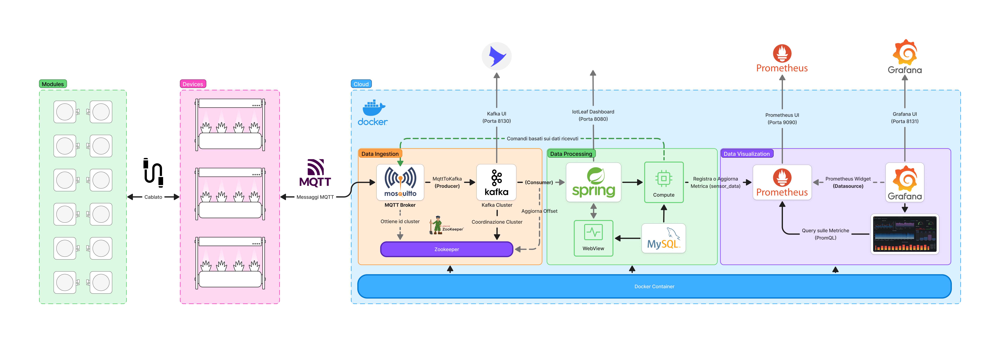

# IotLeaf

### 📝 Descrizione

> IotLeaf è un sistema avanzato per la gestione distribuita di dispositivi smart, progettato per monitorare e controllare automaticamente le condizioni delle piante. Attraverso una pipeline di streaming ad-hoc, il sistema raccoglie dati sui parametri ambientali (umidità del suolo, illuminazione, temperatura) e attiva azioni automatizzate come irrigazione, regolazione della luce e controllo della temperatura.

### 🛠️ Architettura del Sistema


Il sistema è basato su un'architettura a microservizi e utilizza le seguenti tecnologie:

- [Docker](https://docs.docker.com/): Permette di eseguire i servizi in ambienti containerizzati, garantendo scalabilità, isolamento e facilità di deploy su diverse infrastrutture.
- [Mosquitto](https://hub.docker.com/_/eclipse-mosquitto): Scelto come broker MQTT per la sua leggerezza e affidabilità nella gestione della comunicazione tra dispositivi IoT e backend.
- [mqtt2KafkaBridge](https://hub.docker.com/r/marmaechler/mqtt2kafkabridge): Convertitore da MQTT a Kafka per permettere l'integrazione con uno streaming event-based scalabile.
- [Zookeeper](https://hub.docker.com/r/bitnami/zookeeper): Necessario per gestire il coordinamento e la configurazione dei broker Kafka, garantendo alta disponibilità e affidabilità.
- [Kafka](https://hub.docker.com/r/bitnami/kafka): Sistema di messaggistica distribuito scelto per la sua capacità di gestire flussi di dati in tempo reale con alta resilienza e throughput elevato.
- [Kafka UI](https://hub.docker.com/r/provectuslabs/kafka-ui): Strumento di monitoraggio per una gestione più semplice dei topic Kafka.
- [Spring Boot](https://spring.io/projects/spring-boot): Utilizzato per sviluppare i microservizi backend grazie alla sua modularità, scalabilità e integrazione con Kafka e database relazionali.
- [Prometheus](https://hub.docker.com/r/prom/prometheus): Scelto per il monitoraggio del sistema grazie alla sua capacità di raccogliere e analizzare metriche in tempo reale.
- [Grafana](https://hub.docker.com/r/grafana/grafana): Dashboard avanzata per la visualizzazione delle metriche raccolte da Prometheus, utile per analizzare il funzionamento del sistema.
- [MySQL](https://hub.docker.com/_/mysql): Database relazionale utilizzato per la sua affidabilità e per la gestione delle configurazioni e dei dati storici raccolti.

## ✨ Funzionamento

### 🔧 Configurazione WebUI IoTLeaf
IoTLeaf possiede una comoda interfaccia per gestire `dispositivi`, `moduli`, `sensori`, `piante` e relative `categorie` sulla porta `8080`.
- [Devices](http://localhost:8080/devices): Gestione dei dispositivi registrati e dei rispettivi moduli ad esso connessi.
- [Plants](http://localhost:8080/plants): Gestione delle piante e delle relative configurazioni di base.
- [Plant Types](http://localhost:8080/plantTypes): Gestione delle categorie di piante.
- [Sensors](http://localhost:8080/sensors): Gestione dei tipi di sensori supportati e dei relativi formati.

### 🪪 Registrazione dispositivo al sistema

Il dispositivo smart, mediante protocollo di comunicazione `MQTT`, invia una richiesta di registrazione al topic `registration`:
```json
{
    "request_id": "xxxxxxxxxxxx",
    "data": {
        "irrigation": false,
        "model": "Device model",
        "slots": 1,
        "network": "Default",
        "ipAddress": "192.168.x.x",
        "macAddress": "xx:xx:xx:xx:xx:xx",
        "firmware": "v0.1",
        "uptime": 3600
    },
    "timestamp": xxxxxxxx
}
```
> Il `timestamp` non è obbligatorio nella richiesta.

Il dispositivo deve quindi iscriversi al topic `registration/<request_id>/response` per ricevere una risposta contenente il `device_id` e altre informazioni:
```json
{
    "data": {
        "id": 25,
        "name": "New Device",
        "irrigation": true,
        "lastPing": "xxxx-xx-xx xx:xx:xx",
        "model": "Device model",
        "slots": 6,
        "network": "Default",
        "ipAddress": "192.168.x.x",
        "macAddress": "XX:XX:XX:XX:XX:XX",
        "firmware": "v0.1",
        "uptime": 3600,
        "status": false,
        "uptimeStr": "0 s"
    },
    "success": true,
    "error": null,
    "timestamp": 1739985270713
}
```

## 👷 Installazione

Clona il repository e avvia i servizi con:
```sh
git clone https://github.com/Oliwoo/Iotleaf-tap.git
cd IotLeaf-tap
docker-compose up -d
```

Verifica i servizi:
```sh
docker ps
```

## Testing

Per testare il sistema, utilizza l'emulatore basato su Electron:
```sh
cd emulator
npm install
npm start
```

## ⚙️ Configurazione del file `.env`

Un file `.env` è fornito per configurare parametri essenziali. Modificalo in base alle tue necessità.

Ora sei pronto per eseguire e testare IotLeaf! 🚀
